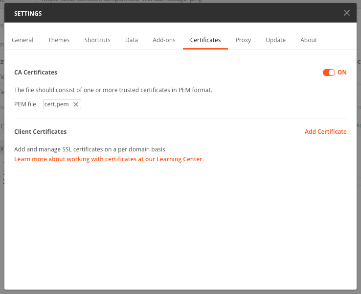

## HTTPs generation

Execute this command and answer the questions that appear:

```bash
openssl req -newkey rsa:2048 -new -nodes -x509 -days 3650 -keyout key.pem -out cert.pem
```

To test HTTPs requests via Postman, ensure you add `cert.pem` into Settings > Certificates as shown in the image:


